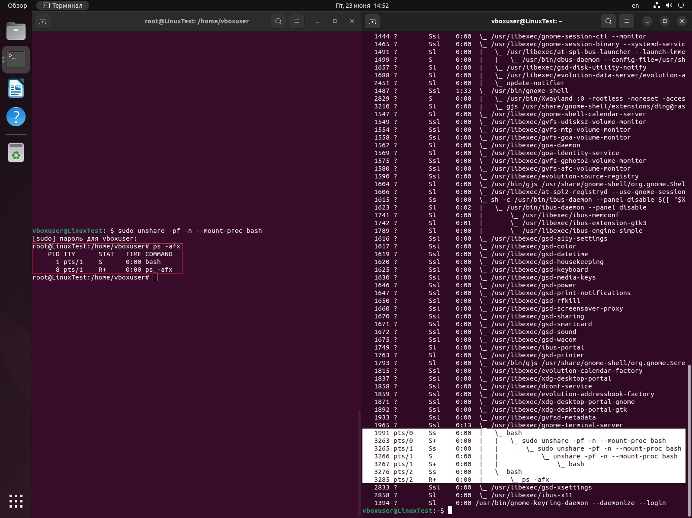
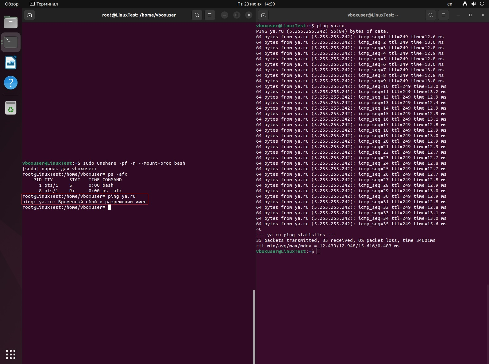
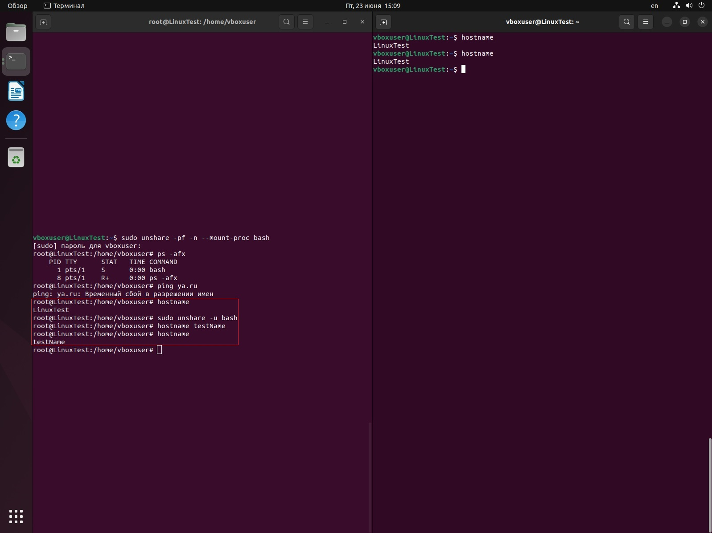

# Контейнеризация ДЗ №1

## Задание: необходимо продемонстрировать изоляцию одного и того же приложения (как решено на семинаре - командного интерпретатора) в различных пространствах имен.

* **Создадим два терминала. В левом запустим Bash с новым пространством имен с помощью команды:**

```
sudo unshare -pf -n --mount-proc bash
```

* **В обоих терминалах выведем список процессов и посмотрим на разницу:**
```
ps -afx
```



**В "чистом" терминале справа было создано несколько процессов, использующих Bash. В изолированном мы видим всего два процесса.**

* **Запустим пинг сайта яндекс на обоих терминалах:**

```
ping ya.ru
```


**Наблюдаем, что в изолированном пространстве имен пинг не может быть осуществлен из-за установленных ограничений. В "чистом" терминале пакеты и передаются и принимаются без ограничений.**

* **Используем на обоих терминалах команду ```hostname```, чтобы отобразить наш хост.**

**После первого применения имя хоста одинаково и в левом и в правом терминалах - LinuxTest.**

* **В изолированном терминале выполним команду:**

```
sudo unshare -u bash
```

**Команда ```unshare``` запускает программу в новом пространстве имен, а флаг -u указывавет запустить bash в новом UTS-пространстве имен. Это значит мы можем поменять hostname на изолированном терминале и это не затронет никакой другой процесс в системе.**

**Изменим наше имя хоста в изолированном терминале**

```
hostname testName
```

* **Снова используем на обоих терминалах команду ```hostname```, чтобы отобразить наш хост.**

**Мы видим, что в изолированном терминале имя хоста изменилось на указанное нами, при этом "чистый" терминал показывает, что имя хоста основной системы осталось незатронутым**




### **Таким образом была продемонстрирована возможность изоляции нужных нам направлений.** 