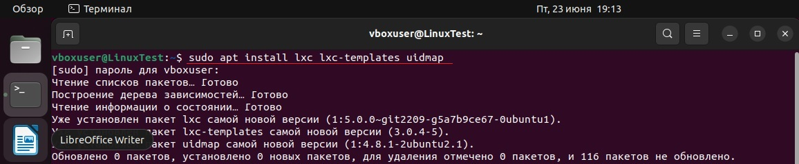
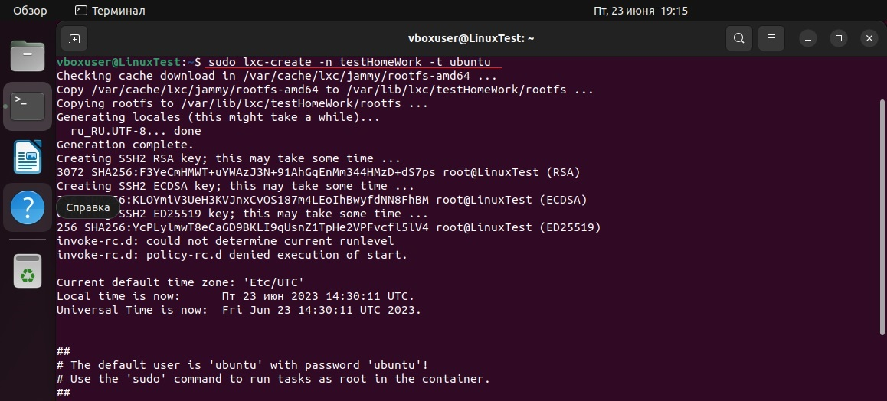
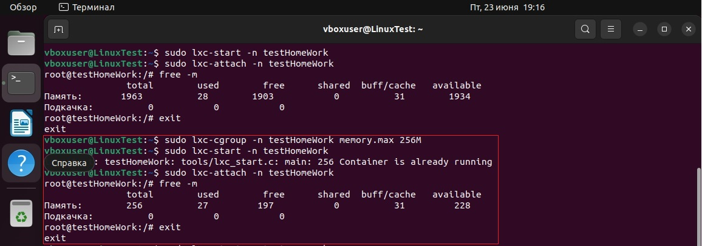
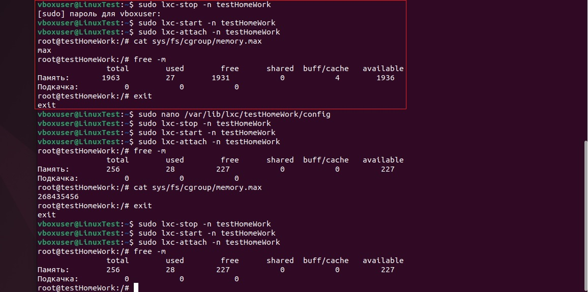
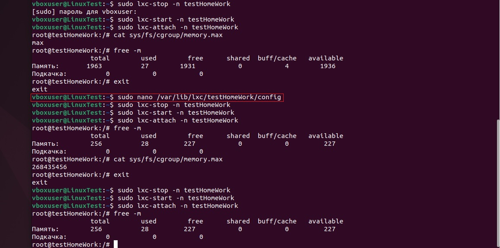
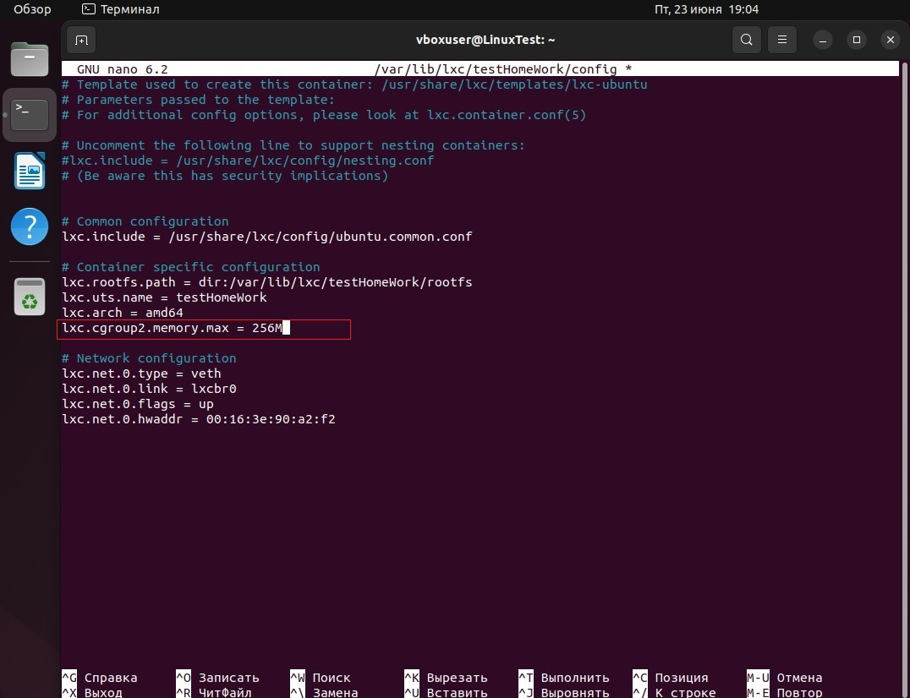
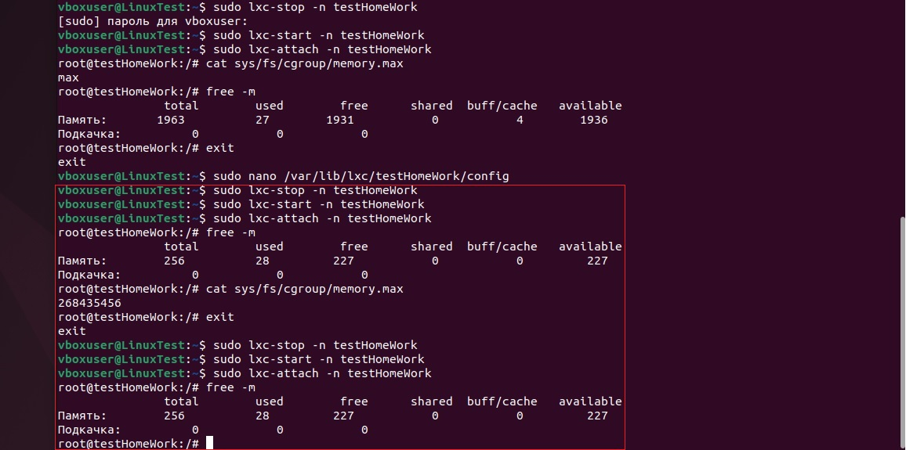

# Контейнеризация ДЗ №2

## Задание: 
## 1. Запустить контейнер с ubuntu, используя механизм LXC
## 2. Ограничить контейнер 256 Мб ОЗУ и проверить, что ограничение работает

* **Производим установку LXC и шаблонов с помощью команды:**

```
sudo apt install lxc lxc-templates uidmap
```



* **Создаем новый контейнер с именем testHomeWork:**

```
sudo lxc-create -n testHomeWork -t ubuntu 
```




* **Запускаем контейнер:**

```
sudo lxc-start -n testHomeWork
```

* **Входим в контейнер (вход происходит под root):**

```
sudo lxc-attach -n testHomeWork
```

* **Вводим следующую команду для просмотра выделенной и свободной памяти:**

```
free -m
```


**Видим, что контейнер потребляет всю доступную память.**

* **Для установки ограничения памяти воспользуемся командой:**

```
sudo lxc-cgroup -n testHomeWork memory.max 256M
```



**Снова входим в контейнер, проверяем выделенную память и видим, что количество памяти уменьшилось до заданного нами размера в 256Мб.**

**Минус данного способа в том, что после остановки контейнера:**

```
sudo lxc-stop -n testHomeWork
```

**и повторного запуска контейнера, судя по проверке, он снова берет всю выделенную память.**



* **Для решения проблемы перейдем в файл конфигурации контейнера и воспользуемся текстовым редактором nano:**

```
sudo nano /var/lib/lxc/testHomeWork/config
```



* **В файл конфигурации добавим и сохраним следующую строку:**

```
lxc.cgroup2.memory.max = 256M
```



* **Остановим и заново запустим контейнер, а так же снова проверим отведенную память:**



**Как видим, при повторных остановках и запусках отведенная память контейнера больше не сбрасывается и составляет 256Мб.** 