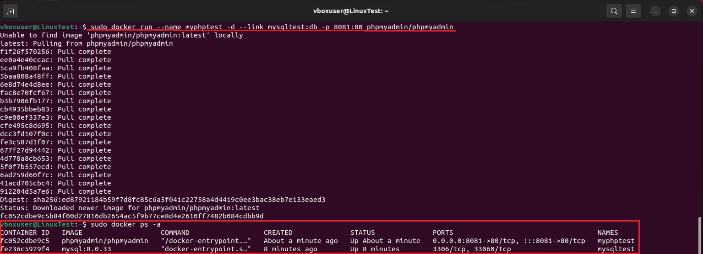

# Контейнеризация ДЗ №3

## Задание:
## 1. запустить контейнер с БД, отличной от mariaDB, используя инструкции на сайте: https://hub.docker.com/
## 2. добавить в контейнер hostname такой же, как hostname системы через переменную
## 3. заполнить БД данными через консоль
## 4. запустить phpmyadmin (в контейнере) и через веб проверить, что все введенные данные доступны

* **Запускаем и скачиваем контейнер mysql с помощью команды:**

```
sudo docker run --name mysqltest -h "$HOSTNAME" -e MYSQL_ROOT_PASSWORD=qwerty -d mysql:8.0.33
```

**Указываем имя контейнера `--name mysqltest` присваиваем контейнеру hostname системы `-h "$HOSTNAME"` 
пароль `-e MYSQL_ROOT_PASSWORD=qwerty` и версию mysql `mysql:8.0.33`**


* **"Проваливаемся" в контейнер:**

```
sudo docker exec -it mysqltest bash
```

* **Входим в нашу БД с паролем:**

```
mysql -u root -p
```

* **Просматриваем нашу БД:**

```
show databases;
```

* **Создадим нашу новую БД и присвоим ей имя:**

```
create database mynewDB;
```

* **И снова проверим нашу новую БД:**

```
show databases;
```

**Видим, что она отобразилась**


* **Запустим и скачаем контейнер с образом phpmyadmin для дальнейшего взаимодействия с БД в интерактивном режиме (так же зададим ему имя `--name myphptest`):**

```
sudo docker run --name myphptest -d --link mysqltest:db -p 8081:80 phpmyadmin/phpmyadmin
```

* **Проверим, что контейнеры работают:**

```
sudo docker ps -a
```

**Видим, что все в порядке**



* **Снова "проваливаемся" в наш контейнер `sudo docker exec -it mysqltest bash`, входим в нашу БД с паролем `mysql -u root -p`, переходим в нашу созданную БД `use mynewDB;` и создаем в ней таблицу:**

```
create table `students` (  personid   INT(50),   name   VARCHAR(35),   age   INT(50));
```

**Командой `show tables;` проверяем, что все создалось.**


* **Теперь заполним нашу таблицу данными:**

```
INSERT INTO `students` (`personid`, `name`, `age`) VALUES (`1`, `Petr`, `22`);
```

```
INSERT INTO `students` (`personid`, `name`, `age`) VALUES (`2`, `Vlad`, `20`);
```

```
INSERT INTO `students` (`personid`, `name`, `age`) VALUES (`3`, `Alisa`, `21`);
```

* **Командой `select * from students;` проверяем нашу таблицу и видим, что все хорошо.**


* **Проверим нашу БД в веб-версии**


**Видим, что все отлично отображается**

### P.s.

**Ошибка при попытке задать hostname контейнеру такой же, как hostname системы через переменную `-e MYSQL_HOST="$HOSTNAME"`.**

**Все попытки и различные вариации вели к ошибке:**

**Пояснение в документации Docker так же намекает, что данный способ задать hostname при использовании контейнера mysql работает плохо: `See also https://dev.mysql.com/doc/refman/5.7/en/environment-variables.html for documentation of environment variables which MySQL itself respects (especially variables like MYSQL_HOST, which is known to cause issues when used with this image).`**


**Поэтому был выбран вариант с флагом -h.**