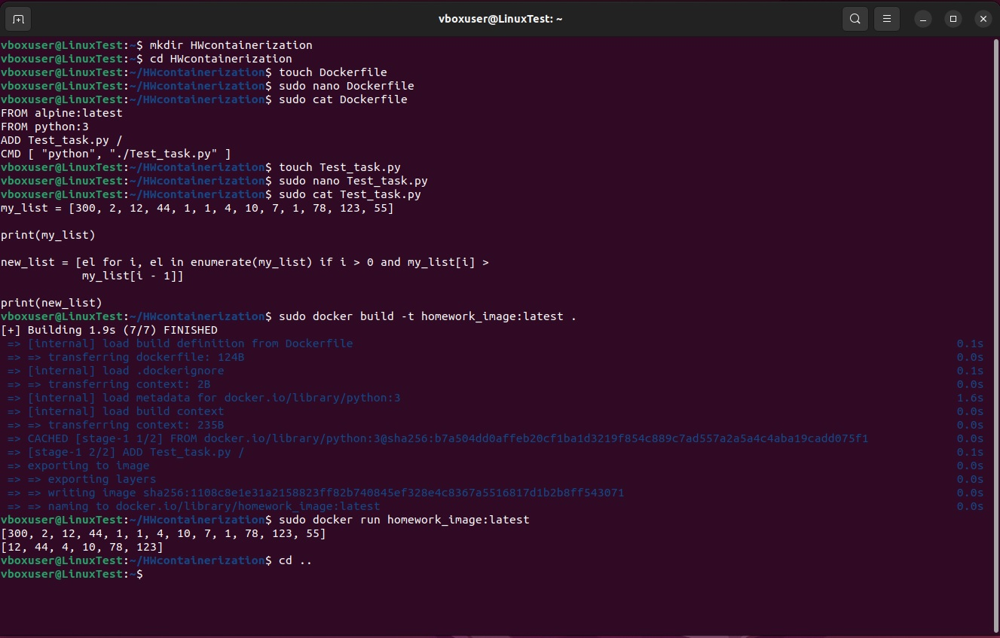

# Контейнеризация ДЗ №3

## Задание:
## Задание: необходимо создать Dockerfile, основанный на любом образе (вы в праве выбрать самостоятельно).
## В него необходимо поместить приложение, написанное на любом известном вам языке программирования (Python, Java, C, С#, C++).
## При запуске контейнера должно запускаться самостоятельно написанное приложение.

* **Создадим и перейдем в новую директорию:**

```
mkdir HWcontainerization
cd HWcontainerization
```

* **Создадим, заполним и просмотрим наш Dockerfile:**

```
touch Dockerfile
sudo nano Dockerfile
sudo cat Dockerfile
```

* **Создадим, заполним и просмотрим наше приложение на языке Python:**

```
touch Test_task.py
sudo nano Test_task.py
sudo cat Test_task.py
```

* **Создадим наш контейнер:**

```
sudo docker build -t homework_image:latest
```

* **Запустим наш контейнер с приложением, выводящим элементы исходного списка, значения которых больше предыдущего элемента:**

```
sudo docker run homework_image:latest
```



**Видим, что при запуске контейнера наше приложение прекрасно работает.**