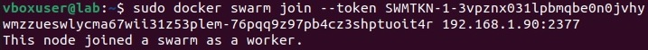
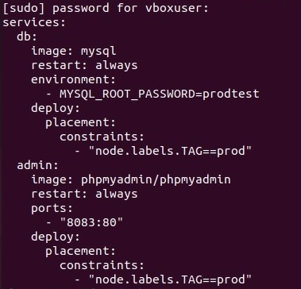
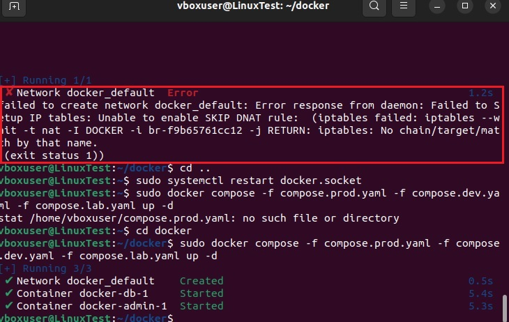

# Контейнеризация ДЗ №5

## Задание

## 1. создать сервис, состоящий из 2 различных контейнеров: 1 - веб, 2 - БД
## 2. необходимо создать 3 сервиса в каждом окружении (dev, prod, lab)
## 3. по итогу на каждой ноде должно быть по 2 работающих контейнера
## 4. выводы зафиксировать

* **Создадим директории наш yml файл и "поднимем его", посмотрим, что наши images тоже запустились:**


* **Пройдем в phpmyadmin, создадим БД:**


* **Проверяем в терминале, что все на месте:**


**Первая часть выполнена, дальше боль и страдание, множество ошибок, десятки часов Гугла и попытки эти самые ошибки исправить и заставить все работать** 

* **Устанавливаем дополнительно еще 3 виртуальных машины к нашей основной (Отдельного удовольствия стоит установка всех надстроек и докера в каждой машине вручную). (Попытки клонирования не увенчались успехом. При подключении к swarm вылетала подобная ошибка)**


**При попытке делать все через Powershell все так же заканчивалось плачевно и решения не нашлось (постоянный отказ в доступе). Поэтому продолжаем в терминалах**


* **Итак, запускаем наш рой**


**Снова пытаемся присоединить машины к рою и ловим ту же ошибку с 4-го скриншота. Упорно гуглим, находим надежду и лезем в файерволл на нашей главной машине**


**Вырубаем файерволл, как советуют умные, англоязычные сайты**

```
systemctl stop firewalld
```

**Пробуем снова добавить наши виртуальные машины в рой и, о чудо, ошибка пропала, машины добавились**



* **Счастливые, проверяем статус наших нодов в терминале. Все работает**


* **Разметим наши ноды**


* **Для того чтобы убедиться, что все прошло успешно, необходимо выполнить следующую команду:**

```
sudo docker node inspect 
```


**В разделе Spec.Labels видим label, который добавили ("TAG": "lab"). Все отлично.**

* **Теперь добавим yml файлы для каждой группы:**

**Для dev:**


**Для lab:**


**Для prod:**



* **И пытаемся все это дело запустить командой:**

```
sudo docker compose -f compose.prod.yaml -f compose.dev.yaml -f compose.lab.yaml up -d 
```

**Получаем леща и грустные идем гуглить**



**И снова нас выручают забугорные коллеги (советов много, поэтому готовимся пробовать их все)**

**Самый первый совет нас и выручает (удивительно), просто перезагружаем докер и снова запускаем наши файлики yml.**


**Все срабатывает, радуемся дальше**

* **Раскидываем сетевые группы**


* **Проверим, что все и везде у нас запущено и работает**


* **Начинаем развлекаться и проверять на работоспособность путем гуляния по контейнерам и вводом паролей**


**Наблюдаем, что в каждом окружении вход осуществляется только по своему заданному паролю, по чужому паролю входа не происходит**


* **Теперь проверим это дело с помощью phpmyadmin**

**Создадим базы данных для каждого окружения, а потом зайдем в них из терминалов и проверим работоспособность**


**Вводим правильные пароли, указанные в yml файлах и заходим в контейнеры**


**Видим, что все, что мы создали, корректно отображается, задача выполнена**

